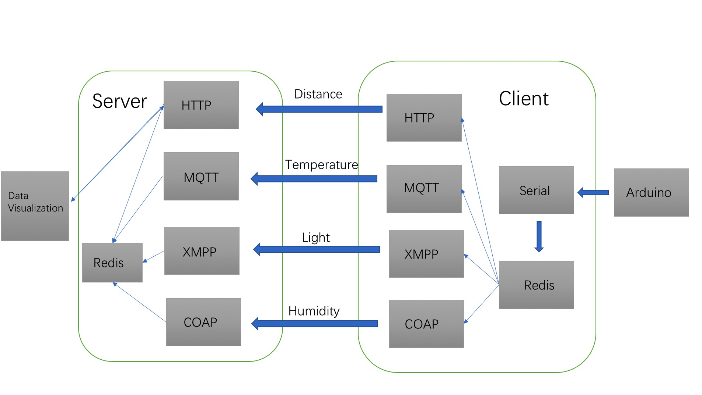

# A Simple Embedded Cloud Computing Platform Based on Arduino

<i>Embedded</i> Course Homework of Software College of Nanjing University. Four network protocols are required to transmit data from four sensors on ardunio.

It's a multiprocess program, including the following processes:

- A process for reading data from serial.

- Mqtt publisher and subscriber

- Http client and server(Including a website based on django)

- XMPP client and server

- Coap client and server

And code for ardunio was attched.

Here follows the structure for paltform:

